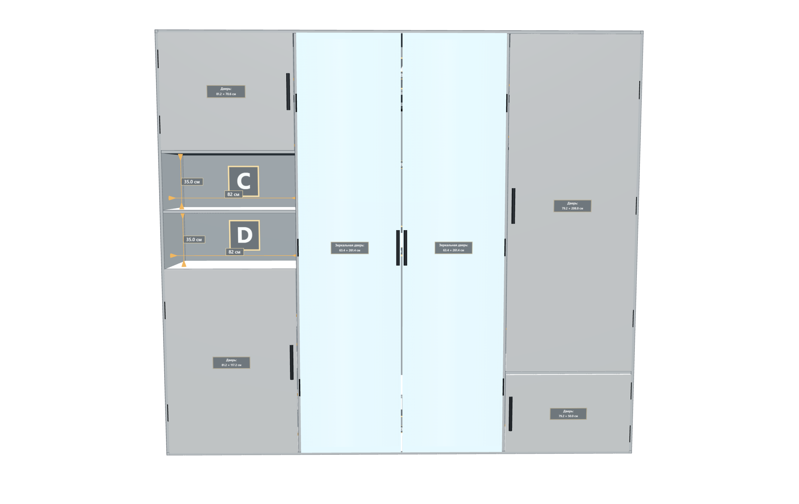
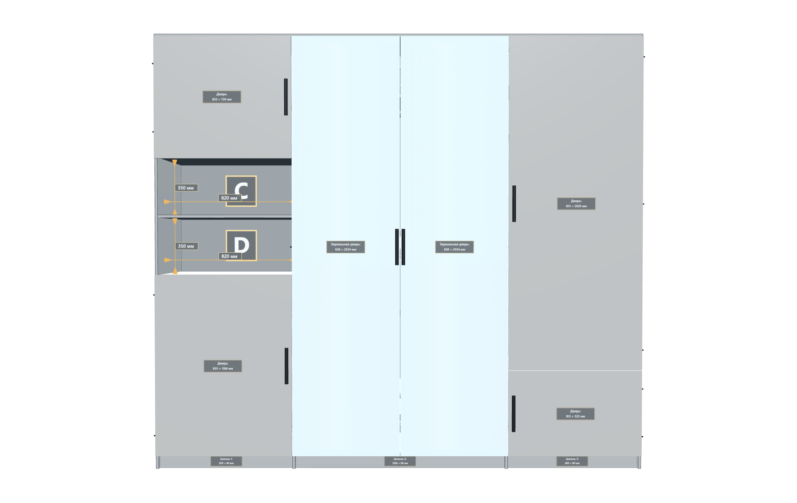
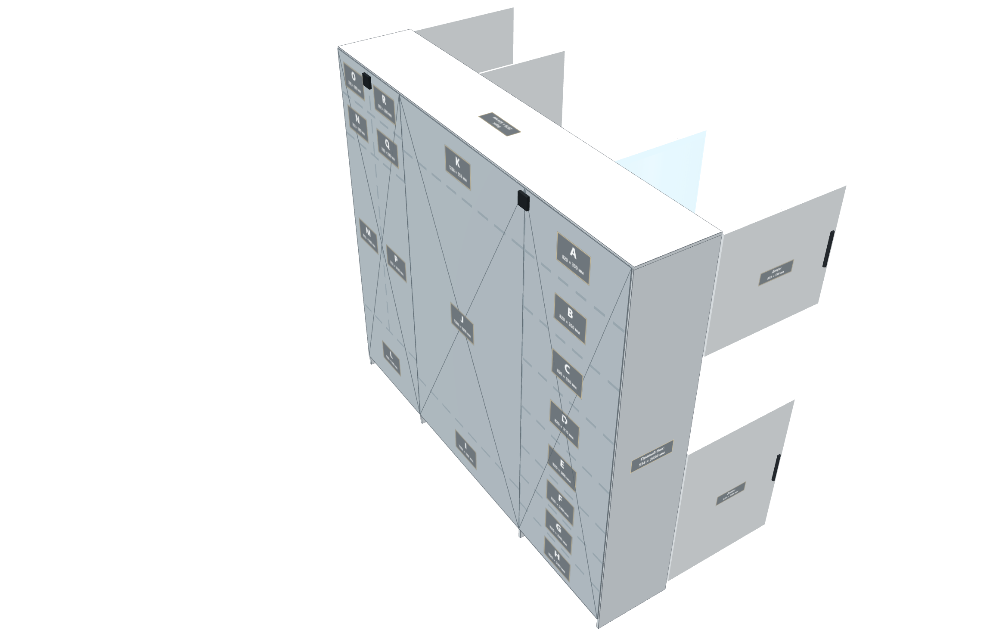

# Furniture 3D Model Example

A lightweight interactive 3D furniture model example, optimized for sharing with craftsmen.

Open the published page in a browser to rotate the model, inspect the dimensions, open or hide the doors, and save a PNG.

## Live demo

[Open the interactive 3D model](https://airshipster.github.io/furniture-3d-model-example/)

## Screenshots

## Technology

- HTML5 and CSS3
- JavaScript modules
- [Three.js](https://threejs.org/) for the 3D scene
- `OrbitControls` from Three.js for touch and mouse navigation
- GitHub Pages for static hosting

## Method and specification

- [Methodology](METHODOLOGY.md) — reusable conventions for modelling, labelling, doors, materials, mobile performance, and review.
- [Current model specification](MODEL_SPEC.md) — the exact dimensions, section notation, doors, labels, and interaction rules used by this example.
- [Furniture project context](FURNITURE_CONTEXT.md) — current project handoff, publication link, and the rule for preserving approved marker positions.

## Reuse with Codex

You can download or clone this repository and give it to Codex as a starting point for a custom furniture model. Ask it to read `METHODOLOGY.md` and `MODEL_SPEC.md` first, then replace the current model with your agreed dimensions and layout while preserving the method. The page is intentionally lightweight for convenient viewing on a phone or when discussing the project with craftsmen.
